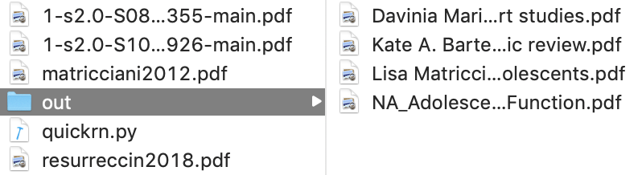

# typea

TypeA is a file renaming tool used by [Type-A personalities][1] to rename PDFs, typically research articles. These research articles often have long names with little meaning. TypeA reads extended file attributes (xattrs) and copies the file to an `out` directory using the format `author - title.pdf`.

## For Geeks

TypeA uses `mdls` to retrieve the extended file attributes. As such, it is not currently available on Windows. I plan to support Windows in future releases (as well as a more robust solution).

## Instructions

**Make sure you have downloaded Python.**

1. Download this repository.
2. Open a terminal session.
3. Navigate to the new repository
4. Move the PDFs you wish to rename
5. Type `./typea.py`
6. The PDFs will be in a folder called `renamed_articles`

## Screenshots

## Todo

1. Support for multiple parameters.
2. Compiled version, placed in bin for easier calls
3. PDF parsing for articles which don't have the needed xattrs.
4. GUI.
5. Tutorial and instructions.
6. Support for other environments.
7. Support for custom paramter placement.
8. CLI parameter for removing old files
9. 

[1]: https://en.wikipedia.org/wiki/Type_A_and_Type_B_personality_theory
