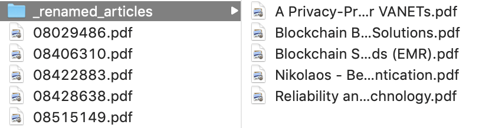

# typea

TypeA is a file renaming tool used by [Type-A personalities][1] to rename PDFs, typically research articles. These
research articles often have long names with little meaning. TypeA reads extended file attributes (xattrs) and copies
the file to a new directory using the format `author - title.pdf`.

## Instructions

### Installation

1. Download this repository.
2. Open a terminal session.
3. Navigate to the new repository.
4. Type `./setup` to install.

### Executing

1. Download this repository.
2. Open a terminal session.
3. Navigate to the new repository
4. Move the PDFs you wish to rename into the project folder (inside the toplevel `typea`).
5. Type `./typea.py` to rename.
6. The PDFs will be in a folder called `renamed_articles`.

## Screenshots

    

## Todo

### Features

1. Support for multiple parameters.
    1. Target input directories
    2. Target output directories
    3. Specify delimeter
    4. Specify naming pattern
    5. Remove old files
2. Convert project to Golang
3. Compiled version, placed in bin for easier calls
4. PDF parsing for articles which don't have the needed xattrs.
6. Better tutorial/instructions.
7. Better title/author discovery.
8. Support for publishers which don't add metadata to PDFs:
    1. arXiv (api)

- [ ] 

### Build

- [ ] .venv ?
- [ ] requirements

[1]: https://en.wikipedia.org/wiki/Type_A_and_Type_B_personality_theory

